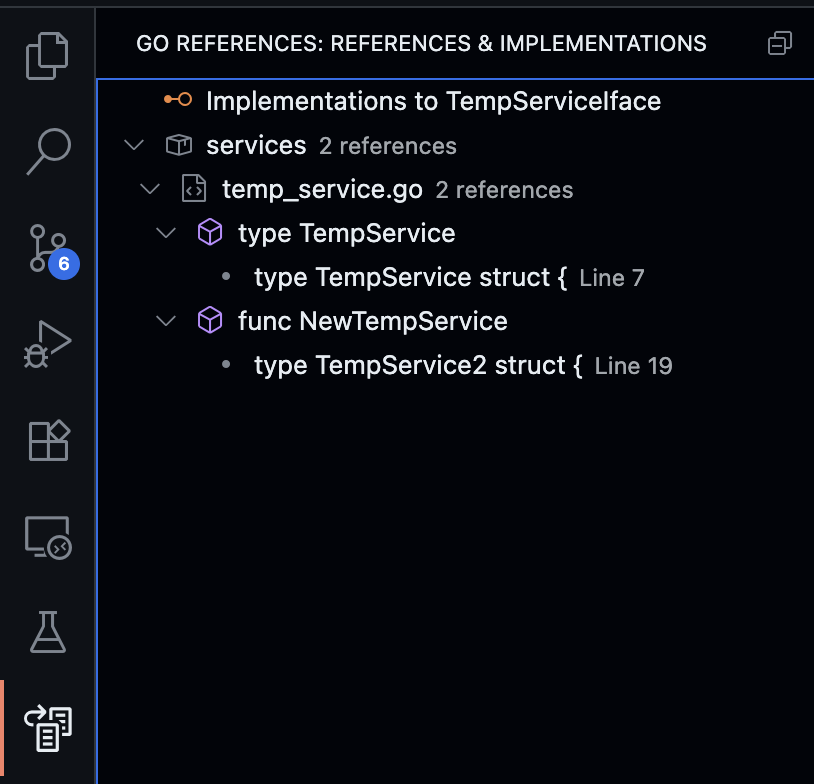

# Go Implementation Lens

A VS Code extension that enhances Go development by providing instant visibility into interface-implementation relationships. Navigate seamlessly between interfaces and their implementations with visual indicators and smart navigation - bringing GoLand/IntelliJ-style functionality to VS Code.


## Key Features

### 🔍 Interface Implementation Discovery
- **Instant Visibility**: See how many implementations an interface has directly in your code
- **Bidirectional Navigation**: Jump from interface → implementations or implementation → interfaces
- **Visual Indicators**: Gutter icons provide at-a-glance awareness of relationships

### 🎯 Smart Navigation
- **Direct Jump**: Single implementation? Go straight to it with one click
- **Organized Sidebar**: Multiple references/implementations? Browse through a hierarchical view
- **Quick Pick Fallback**: Prefer VS Code's built-in picker? Toggle with one setting


### 📊 **Organized Sidebar View** ⭐ *New Feature*
Experience a revolutionary way to browse references and implementations with our hierarchical sidebar that organizes results by package, file, and function for maximum clarity.



**Key Benefits:**
- **Package Grouping**: See which packages contain references at a glance
- **File Organization**: Browse by individual files within each package  
- **Function Context**: Understand exactly where references occur within functions
- **Expandable Tree**: Drill down from high-level overview to specific code lines
- **Always Available**: Stays open while you navigate, unlike popup dialogs

### ⚡ Performance Optimized
- **Intelligent Caching**: Document-level cache minimizes gopls calls
- **Real-time Updates**: Changes reflect immediately without manual refresh
- **Lightweight**: No performance impact on large codebases

### 🎨 Customizable Display
- **CodeLens**: "N implementations" above interfaces, "Implements: X, Y" above types
- **Gutter Icons**: Visual markers for quick identification
- **Sidebar Navigation**: Organized tree view showing references and implementations grouped by package and file
- **Flexible Configuration**: Enable/disable features to match your workflow

## How It Works

The extension leverages gopls (Go language server) through VS Code's `executeImplementationProvider` API, ensuring accurate and up-to-date results. This approach provides:
- **Accuracy**: Uses the same implementation detection as Go's compiler
- **Reliability**: No custom parsing means fewer edge cases
- **Compatibility**: Works seamlessly with all Go project structures

## Usage

1. **Open any Go file** - The extension activates automatically
2. **Look for indicators**:
   - 📍 Above interfaces: "N implementations" link
   - 📍 Above structs: "Implements: Interface1, Interface2..." link
   - 📍 Gutter icons marking interfaces and implementations
3. **Click to navigate**:
   - Single target: Direct navigation to the location
   - Multiple targets: **Organized sidebar view** with package/file/function hierarchy
   - Alternative: Quick pick popup (configurable via settings)

## Requirements

- VS Code 1.74.0 or higher
- Go extension for VS Code (with gopls enabled)

## Configuration

| Setting | Default | Description |
|---------|---------|-------------|
| `goImplementationLens.enable` | `true` | Enable/disable the entire extension |
| `goImplementationLens.showOnInterfaces` | `true` | Show "N implementations" CodeLens above interface definitions |
| `goImplementationLens.showOnTypes` | `true` | Show "Implements: Interface1, Interface2..." CodeLens above struct/type definitions |
| `goImplementationLens.showOnInterfaceHeader` | `false` | Show total implementation count on the interface declaration line (in addition to per-method counts) |
| `goImplementationLens.showGutterIcons` | `true` | Display up/down arrow icons in the editor gutter for interfaces and implementations |
| `goImplementationLens.showReferences` | `true` | Show "N refs" CodeLens and reference navigation functionality |
| `goImplementationLens.useSidebar` | `true` | Use organized sidebar view for navigation instead of VS Code's built-in popup |

### Configuration Examples

**Minimal Setup** (implementations only, no references or gutter icons):
```json
{
  "goImplementationLens.showReferences": false,
  "goImplementationLens.showGutterIcons": false,
  "goImplementationLens.useSidebar": false
}
```

**Implementations Only** (no reference tracking):
```json
{
  "goImplementationLens.showReferences": false
}
```

**Maximum Visibility**:
```json
{
  "goImplementationLens.showOnInterfaceHeader": true,
  "goImplementationLens.showGutterIcons": true,
  "goImplementationLens.showReferences": true,
  "goImplementationLens.useSidebar": true
}
```

### 🔄 **Navigation Modes**

**🌟 Sidebar Mode** (Default - `useSidebar: true`)
Opens an organized tree view that stays visible while you browse:

```
References to MyInterface
└── 📦 controllers (3 references)
    └── 📄 user_controller.go (3 references)
        └── ⚙️ func CreateUser
            ├── myInterface.DoSomething()
            ├── result := myInterface.Process()
            └── return myInterface.Validate()
```

**⚡ Quick Pick Mode** (`useSidebar: false`)
Shows a searchable file picker similar to "Go to File":
```
Go to Implementation (3 found)
├── 📄 service.go          internal/services
│   Line 45: func (s *Service) GetData()...
├── 📄 temp_service.go     internal/services  
│   Line 23: func (t *TempService) GetData()...
└── 📄 grpcHandler.go      internal/controllers
    Line 67: func (h *Handler) GetData()...
```

**Which to choose?**
- **Sidebar**: Best for exploring complex codebases with many references
- **Quick Pick**: Best for quick navigation when you know what you're looking for

## Development

```bash
# Install dependencies
npm install

# Compile
npm run compile

# Watch mode
npm run watch
```

## Testing

Press F5 in VS Code to launch a new Extension Development Host window with the extension loaded.